# Candidate Plants for Fence Decoration

**Goal:** Layer native and California-adapted plants along the fence lines to create a cohesive oak-woodland understory feel. All plants here meet the project requirements:
- Drought-tolerant once established
- Shade-tolerant (handles afternoon oak shade)
- No fleshy fruit (to avoid attracting rodents or flies)
- Variety of textures and heights for a layered look

**Images** are in the `images/` folder, 2–3 photos per plant, sourced from Wikimedia Commons. Images of manzanita cultivars (Dr. Hurd, Howard McMinn, Emerald Carpet) and Ceanothus cultivars (Ray Hartman, Concha) show the parent species or closely related specimens — cultivar-specific photos are not widely available, but overall form and texture are representative.

---

## Plant List by Layer

---

### TALL BACKDROP — 6–15 ft

These anchor the fence visually, provide year-round screening, and define the uppermost layer. Place directly against the fence.

---

#### 1. Ceanothus 'Ray Hartman' *(California Lilac — tall form)*

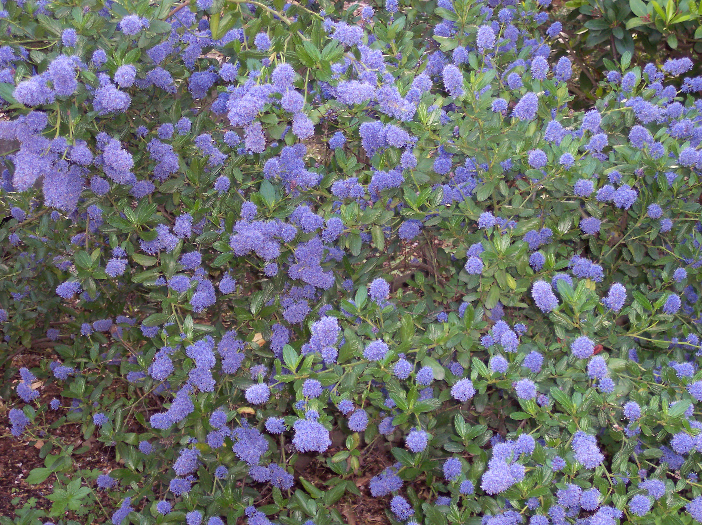  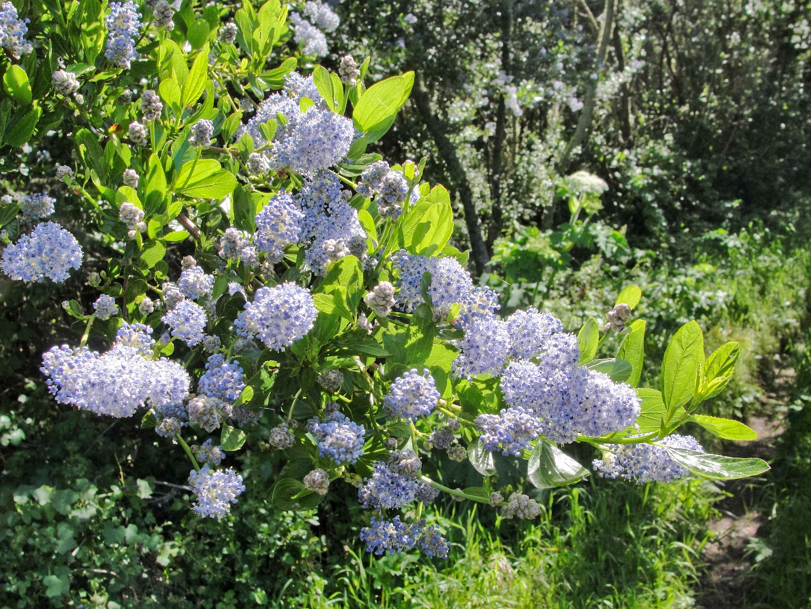

| | |
|---|---|
| **Height** | 8–15 ft |
| **Texture** | Dense, small glossy leaves; intense blue flower clusters in spring |
| **Shade tolerance** | Partial shade OK; prefers some sun |
| **Drought tolerance** | Very high once established |
| **Fruit?** | No (small dry capsules, not fleshy) |

Ray Hartman is one of the best fast-filling screening shrubs for a California fence line. It can be pruned into a semi-tree form with a single trunk, creating an architectural look similar to a small multi-stemmed tree. Spring bloom is spectacular — masses of deep blue flowers. Evergreen year-round.

**Best placement:** Back fence, sunny sections of right fence.

---

#### 2. Manzanita 'Dr. Hurd' *(Arctostaphylos manzanita 'Dr. Hurd')*

  

| | |
|---|---|
| **Height** | 8–12 ft (can be pruned to shape) |
| **Texture** | Smooth burgundy/red bark; small leathery dark green leaves; pale pink urn-shaped flowers in winter |
| **Shade tolerance** | Partial shade OK |
| **Drought tolerance** | Exceptional — one of the most drought-hardy shrubs in California |
| **Fruit?** | No (small dry berries not favored by rodents; can remove with pruning) |

The most architecturally striking plant on this list. The smooth, burnished red-brown bark is beautiful year-round and gives the fence line a sculptural quality unlike anything else. 'Dr. Hurd' is an upright cultivar that can be limbed up into a small multi-trunk tree form. Evergreen.

**Best placement:** Corners of back fence and left fence — accent specimens, not mass planting.

---

#### 3. Western Redbud *(Cercis occidentalis)*

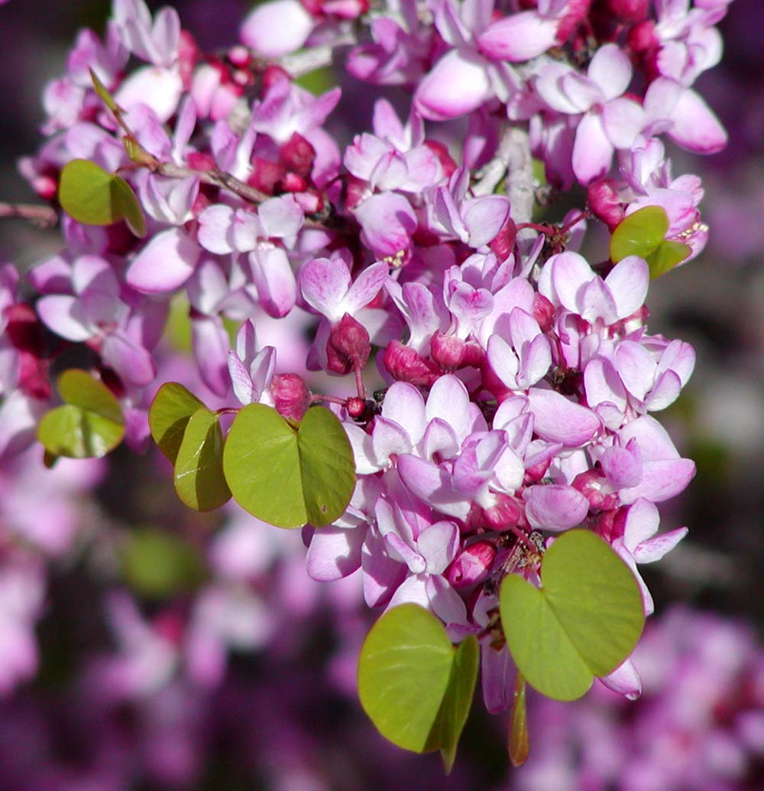 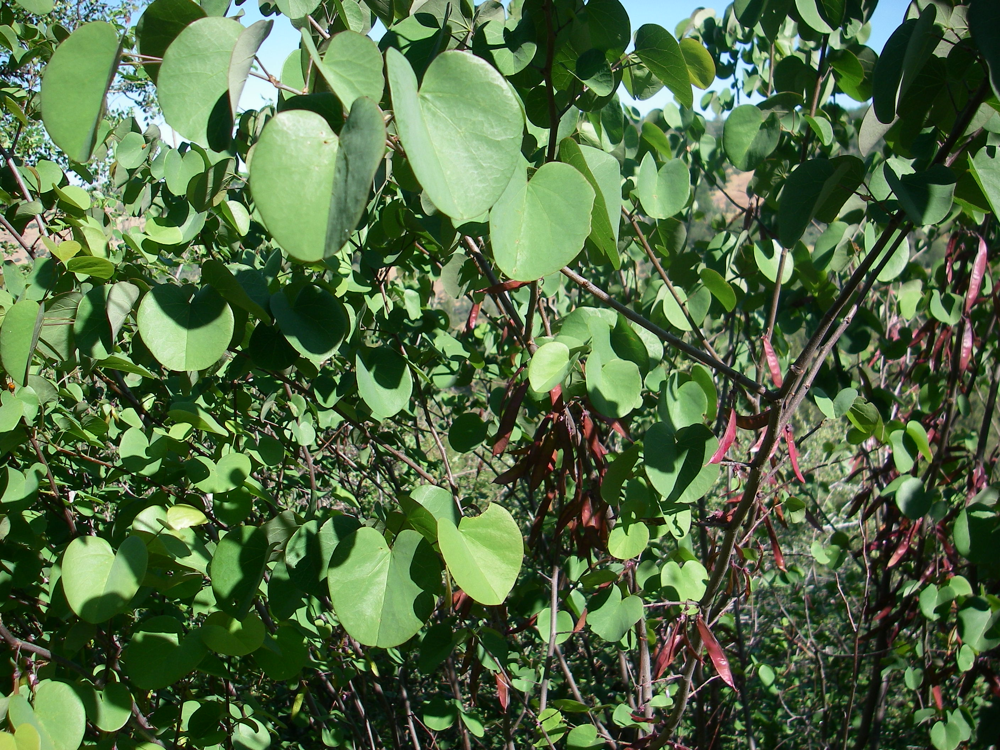 

| | |
|---|---|
| **Height** | 8–15 ft (small tree or large shrub) |
| **Texture** | Rounded heart-shaped leaves; bright magenta flowers directly on bare branches in late winter before leaves emerge |
| **Shade tolerance** | Partial shade tolerant |
| **Drought tolerance** | Very high once established |
| **Fruit?** | Produces flat seed pods (not fleshy; not pest-attracting) |

The winter bloom is one of the most striking displays in California native gardening — hot pink flowers on bare gray wood. Then round blue-green leaves emerge through summer, turning yellow in fall before the plant goes briefly deciduous. The branching structure is naturally sculptural. This is a deciduous plant, so combine with an evergreen backdrop to avoid a bare look in winter.

**Best placement:** Left fence corners (shade-tolerant); use as an occasional specimen, not mass-planted.

---

#### 4. Silk Tassel Bush *(Garrya elliptica)*

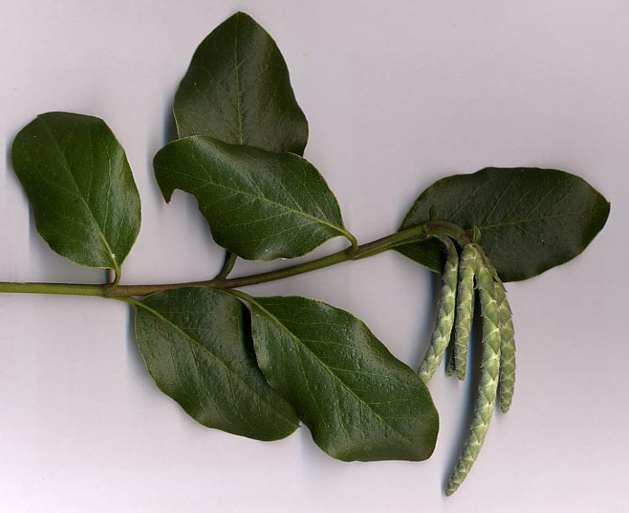 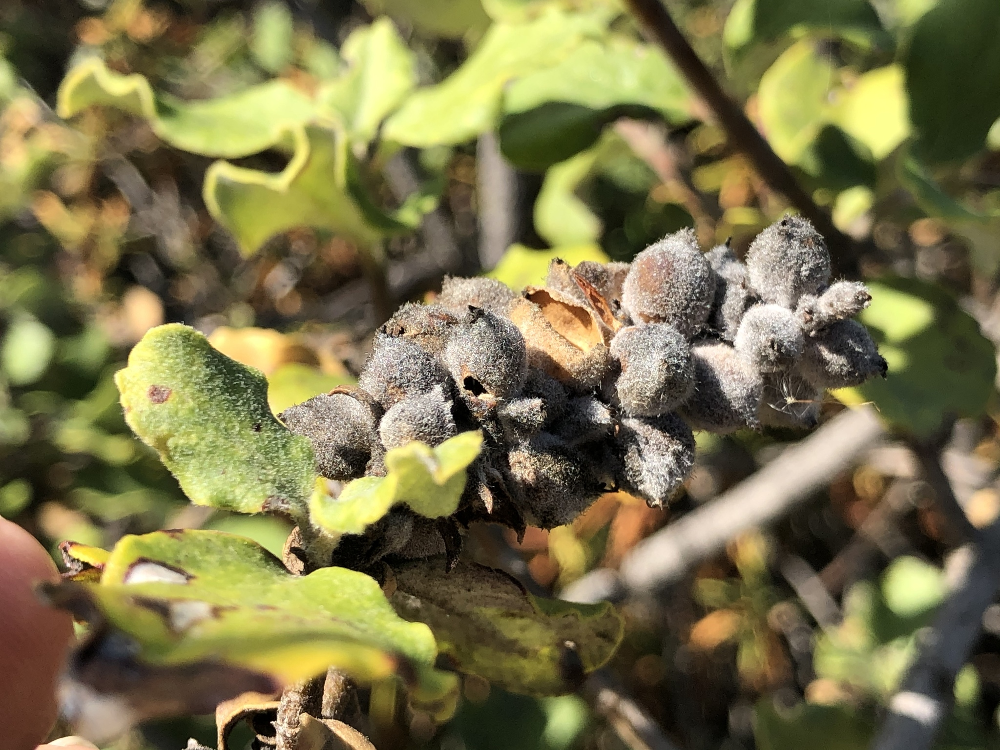 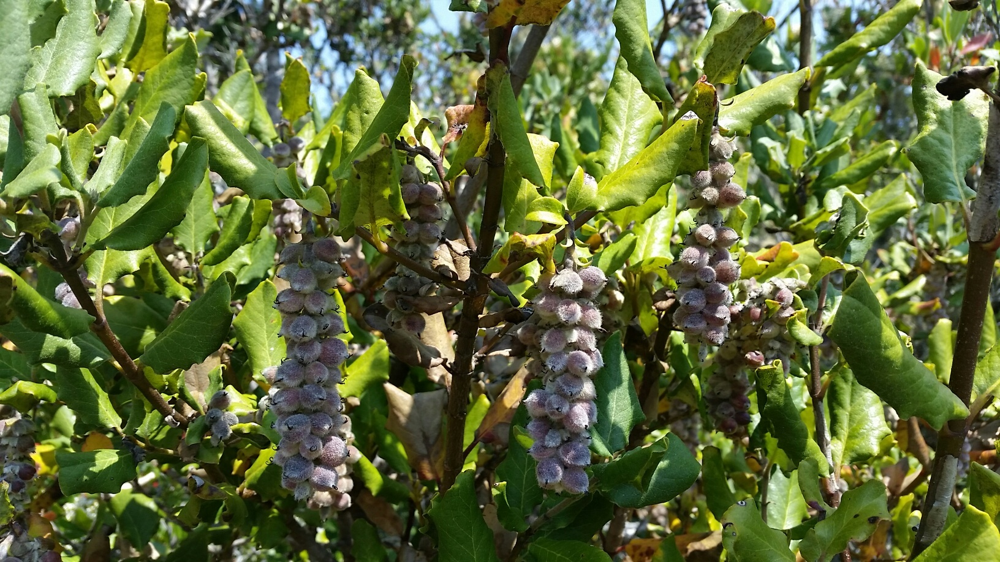

| | |
|---|---|
| **Height** | 6–12 ft |
| **Texture** | Thick, leathery wavy-edged dark green leaves; long silvery catkin tassels in winter (12–18 inches on male plants) |
| **Shade tolerance** | Excellent — one of the most shade-tolerant tall shrubs for California |
| **Drought tolerance** | High once established |
| **Fruit?** | Male plants produce catkins only; female plants produce small dry berry clusters. Use male plants (cultivar 'James Roof' is most dramatic). |

Garrya is underused in California gardens but perfect for a shaded fence line. The long silvery-grey catkins in December–February are extraordinary. Dense, evergreen, and tolerates deep shade better than almost any other tall native. 'James Roof' has the longest tassels.

**Best placement:** Left fence under the oak canopy — this is the most shade-tolerant tall plant on the list.

---

### MEDIUM SHRUBS — 3–6 ft

The middle layer that creates visual depth and variety in front of the tall backdrop plants.

---

#### 5. Manzanita 'Howard McMinn' *(Arctostaphylos densiflora 'Howard McMinn')*

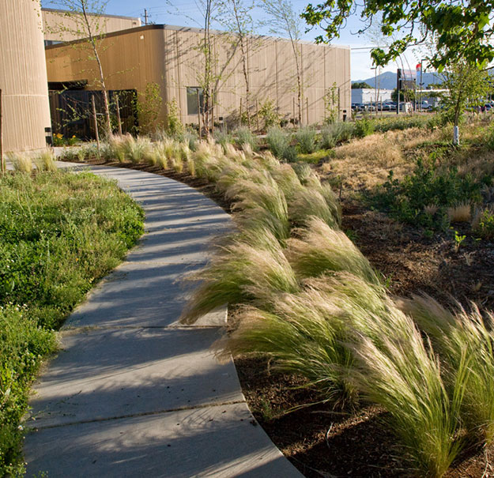  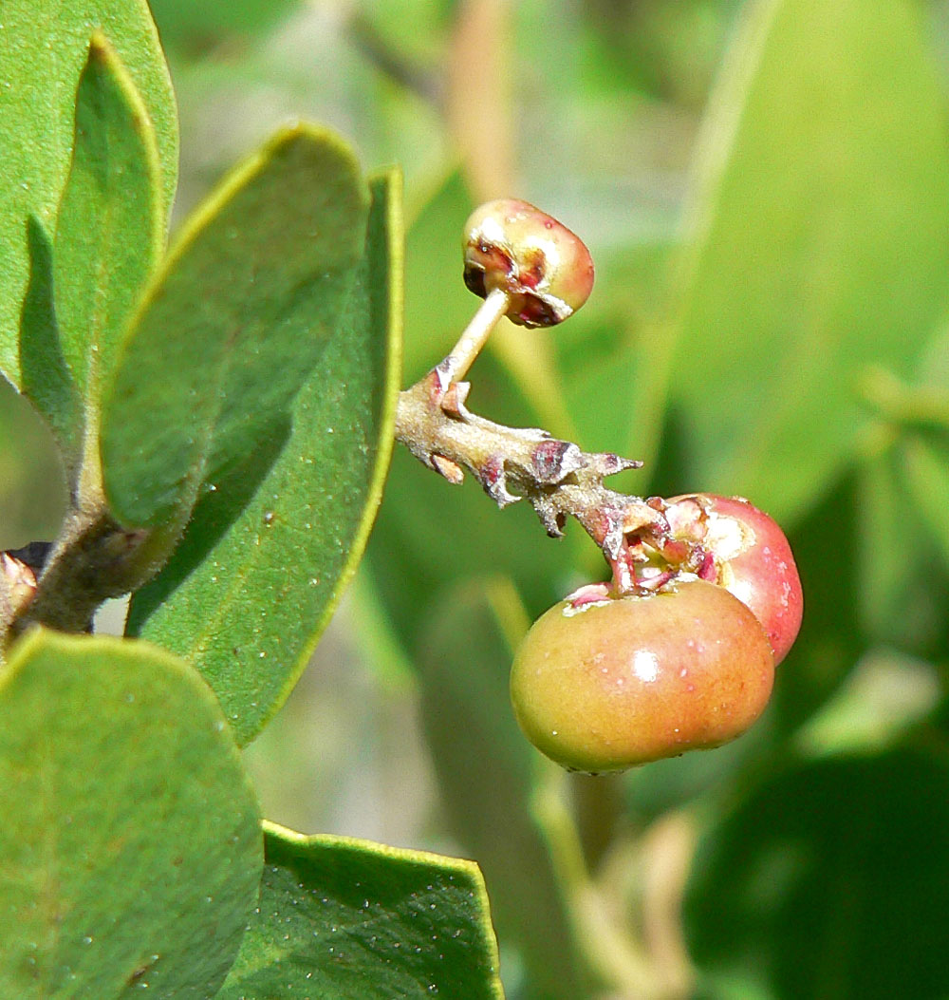

| | |
|---|---|
| **Height** | 4–6 ft tall, 6–8 ft wide (wide mounding habit) |
| **Texture** | Dense fine-textured dark green leaves; small pink-white flowers in winter; reddish bark visible through the plant |
| **Shade tolerance** | Good — one of the most shade-tolerant manzanitas; recommended for partial shade |
| **Drought tolerance** | Very high |
| **Fruit?** | No |

Howard McMinn is the go-to manzanita for part-shade conditions. Where Dr. Hurd is an upright focal point, Howard McMinn is a dense mounding shrub that makes excellent mid-layer filler. Evergreen. The reddish branching visible through the foliage adds winter interest.

**Best placement:** Left fence and shaded portions of back fence, in front of or beside taller specimens.

---

#### 6. Ceanothus 'Concha' *(California Lilac — compact form)*

 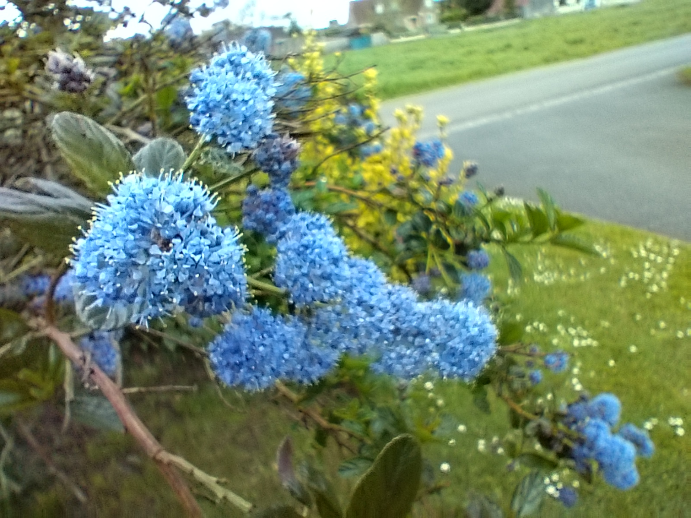 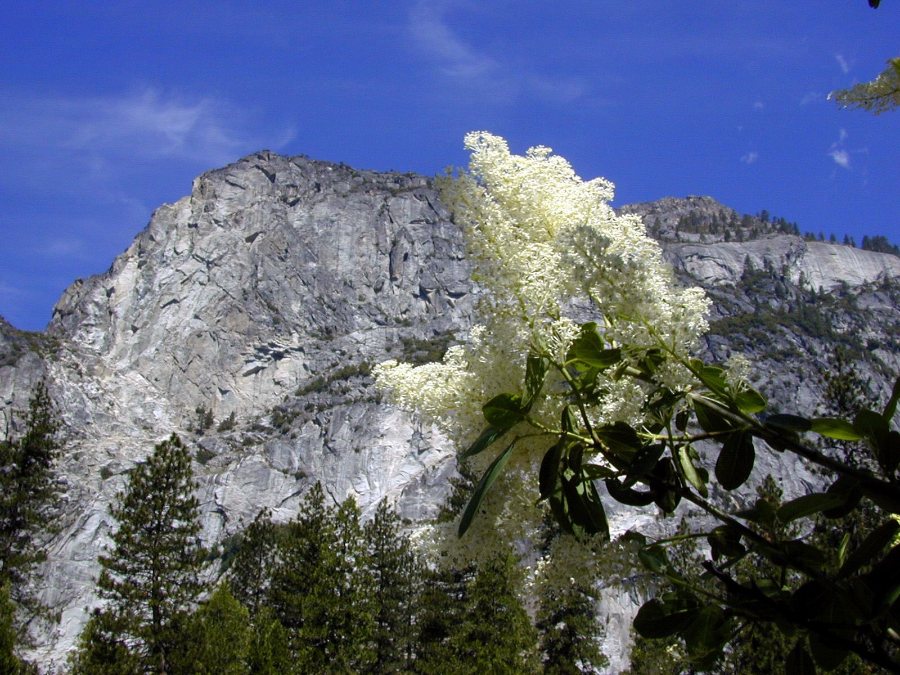

| | |
|---|---|
| **Height** | 5–7 ft |
| **Texture** | Dense, small dark green leaves; intense deep-blue flower clusters in spring |
| **Shade tolerance** | Partial shade OK; appreciates afternoon shade in inland locations |
| **Drought tolerance** | Very high once established |
| **Fruit?** | No |

'Concha' is the most floriferous and densely mounding Ceanothus cultivar — it forms a tight, full shrub rather than the airy tree-form of Ray Hartman. Spring bloom is an intense deep cobalt blue. Where Ray Hartman fills vertical space, Concha fills horizontal space. Together they create a full-coverage Ceanothus layering.

**Best placement:** Middle ground on back and right fence; can mass-plant for a dense blue-flowering hedge effect.

---

#### 7. Hummingbird Sage *(Salvia spathacea)*

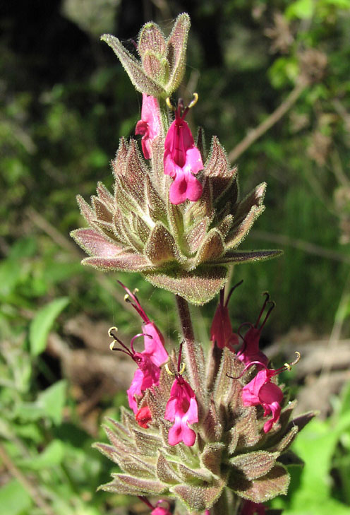  

| | |
|---|---|
| **Height** | 1.5–3 ft tall; spreads widely by rhizomes |
| **Texture** | Broad, wrinkled, highly aromatic leaves (strongly scented when brushed); tall purple-pink flower spikes in spring |
| **Shade tolerance** | Excellent — thrives in dry shade under oaks |
| **Drought tolerance** | Very high |
| **Fruit?** | No |

One of the best plants for dry oak woodland conditions, full stop. The large textured leaves create a lush look even in dry summers. It spreads slowly by underground runners to fill an area over a few years. The fragrance (sage-like, slightly fruity) is pleasant when you brush against it. A key plant for the shaded fence sections.

**Best placement:** Left fence under oaks; generous drifts, not single plants.

---

#### 8. Sticky Monkey Flower *(Diplacus aurantiacus)*

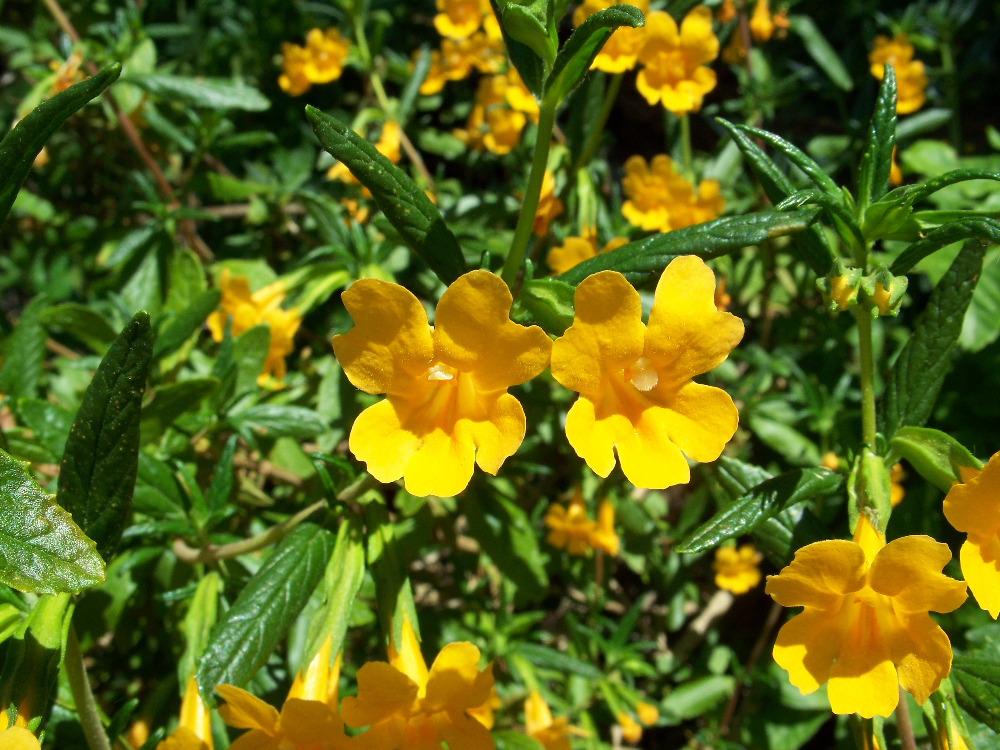 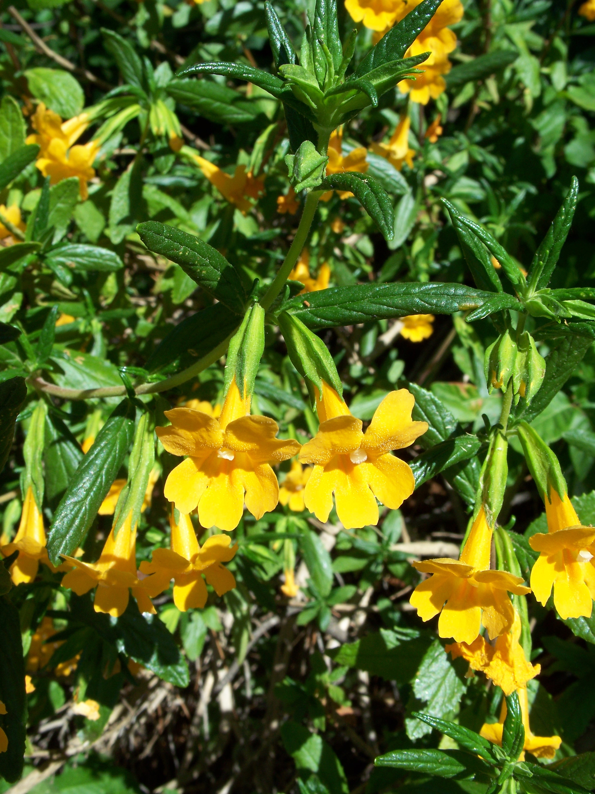 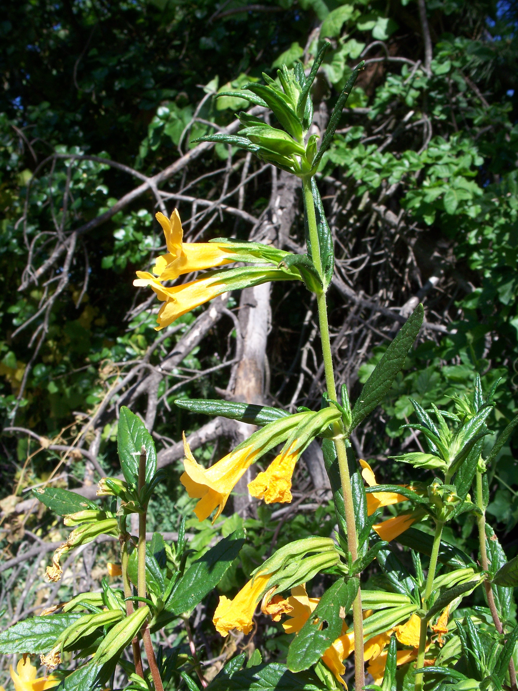

| | |
|---|---|
| **Height** | 2–4 ft |
| **Texture** | Sticky, lance-shaped dark green leaves; bright orange (or cream/red) trumpet-shaped flowers, spring through fall |
| **Shade tolerance** | Light to partial shade; prefers some sun for best flowering |
| **Drought tolerance** | Very high |
| **Fruit?** | No |

Provides the longest bloom season of any plant on this list — flowering from March through November in a good year. The sticky quality of the leaves is a signature sensory detail. Orange or cream flower forms both work with the California woodland palette.

**Best placement:** Brighter sections of back fence and right fence where it gets some sun.

---

#### 9. Cleveland Sage *(Salvia clevelandii)*

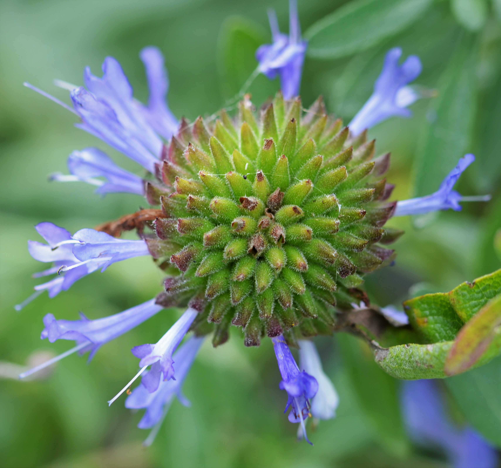  

| | |
|---|---|
| **Height** | 3–5 ft |
| **Texture** | Silvery-grey-green aromatic leaves; whorled blue-purple flowers on tall stems in late spring |
| **Shade tolerance** | Light to partial shade; handles morning shade |
| **Drought tolerance** | Exceptional |
| **Fruit?** | No |

Cleveland sage brings the California chaparral palette — silvery foliage that shimmers in afternoon light, strongly aromatic when brushed, beautiful in winter when the silvery stems are exposed. The cultivar 'Winnifred Gilman' has intense blue flowers. Works well in the brighter sections where hummingbird sage might be too shade-demanding.

**Best placement:** Back fence and right fence, sunny-ish spots; alternates with Concha ceanothus for textural variety.

---

### LOW FRONT LAYER — 1–3 ft

The finishing layer along the turf edge and in front of the medium shrubs. These plants soften the transition from fence to lawn.

---

#### 10. California Fuchsia *(Epilobium canum)*

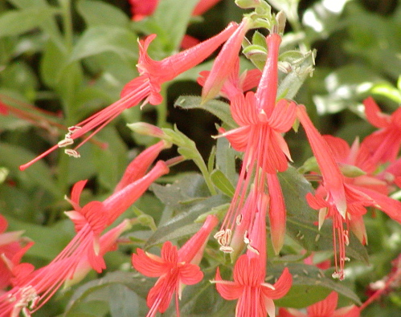  

| | |
|---|---|
| **Height** | 1–3 ft; spreads to 3–4 ft wide |
| **Texture** | Small grey-green leaves; vivid scarlet tubular flowers in late summer through fall |
| **Shade tolerance** | Light to partial shade; best bloom in sun |
| **Drought tolerance** | Exceptional |
| **Fruit?** | No |

California fuchsia is the last plant of the season to bloom (August through October), bridging the gap when other natives have finished. The bright red tubular flowers are irresistible to hummingbirds. It dies back to the ground in winter and resurges in spring. Cut to the ground in February for clean regrowth.

**Best placement:** Sunny patches along the back and right fence, as seasonal color accents.

---

#### 11. Douglas Iris *(Iris douglasiana)*

  

| | |
|---|---|
| **Height** | 1–1.5 ft; forms spreading clumps |
| **Texture** | Narrow strap-like evergreen leaves; purple to lavender flowers in early spring |
| **Shade tolerance** | Excellent — one of the best for dry partial shade |
| **Drought tolerance** | Very high once established |
| **Fruit?** | No |

Douglas iris is the most elegant low plant for the shaded fence line. The grass-like evergreen foliage looks clean and refined year-round. Spring flowers are a bonus. It spreads slowly into tidy clumps. Use in generous sweeps along the fence edge for a meadow-like effect.

**Best placement:** Left fence under oaks; also the curved edge where fence meets the turf lawn.

---

#### 12. Coral Bells *(Heuchera maxima)*

 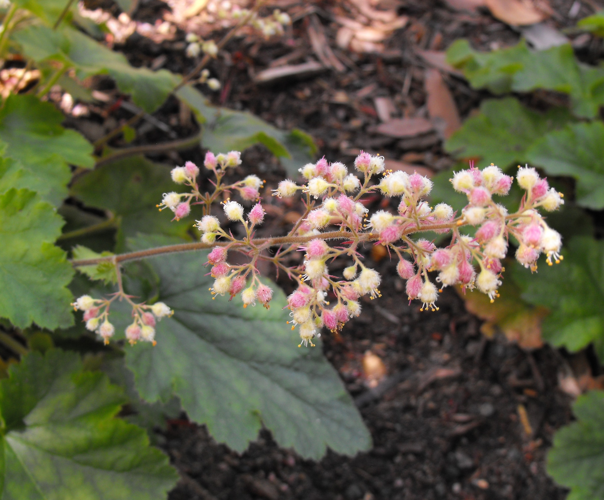 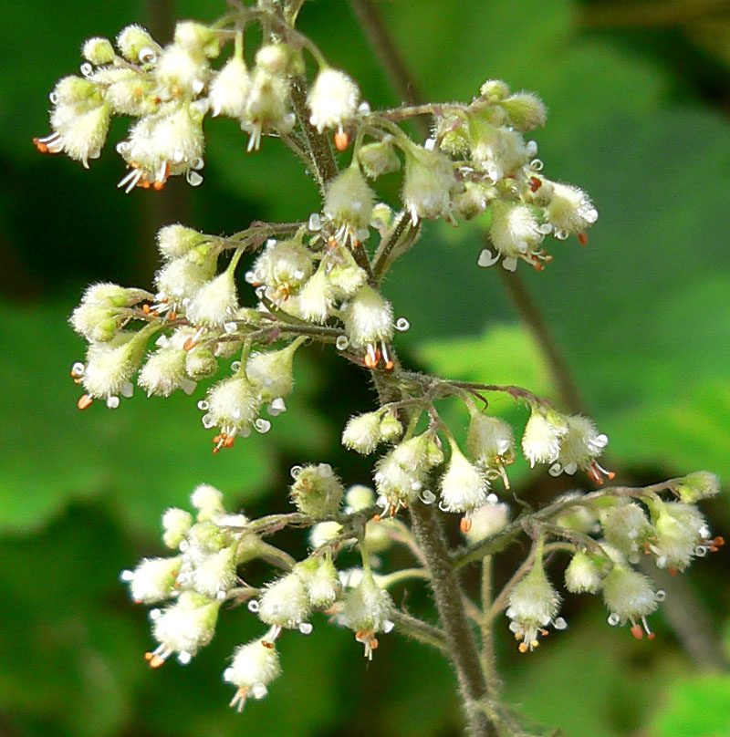

| | |
|---|---|
| **Height** | 1–2 ft; mounding rosette habit |
| **Texture** | Broad, lobed, palm-like leaves; delicate white flower wands in spring |
| **Shade tolerance** | Excellent — a true shade plant |
| **Drought tolerance** | Good once established (needs some summer water in deep shade) |
| **Fruit?** | No |

*Heuchera maxima* is the large-leafed native Island Alumroot — more architectural than the small garden coral bells. The broad foliage creates a bold tropical-ish look at the base of the fence that contrasts well with fine-textured grasses and sedges. Year-round evergreen interest.

**Best placement:** Deep shade spots on the left fence under the heaviest oak canopy; clusters of 3–5 plants.

---

#### 13. Blue-eyed Grass *(Sisyrinchium bellum)*

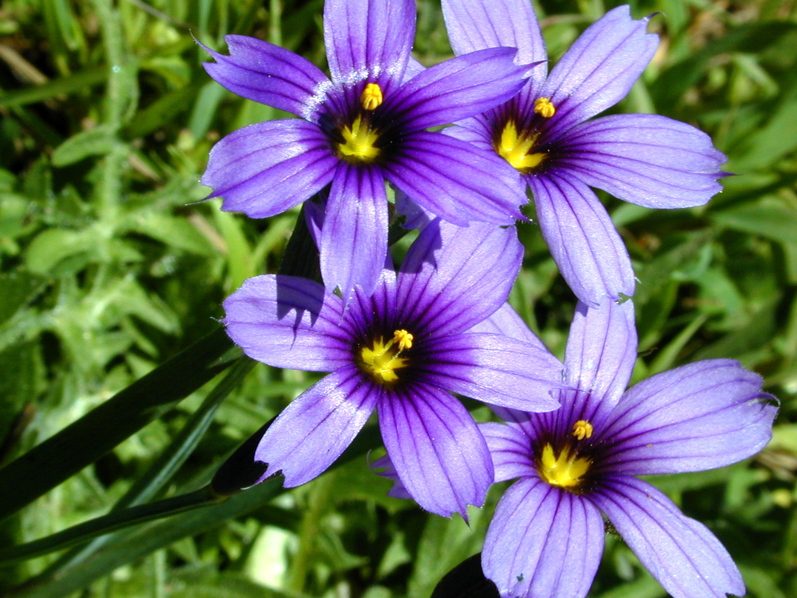  

| | |
|---|---|
| **Height** | 6–18 inches; narrow clumping habit |
| **Texture** | Very fine linear leaves (looks like grass); tiny blue-purple flowers with yellow eye in spring |
| **Shade tolerance** | Light to partial shade |
| **Drought tolerance** | High |
| **Fruit?** | No |

Despite the name, blue-eyed grass is actually a native iris relative. It has the finest, most delicate texture on this list — use it as a contrast to the broader-leaved plants. Spreads by seed slowly. The spring flowers are tiny but intense.

**Best placement:** Along the turf edge; scatter through lower layer of back fence to add texture variation.

---

#### 14. Creeping Sage *(Salvia sonomensis)*

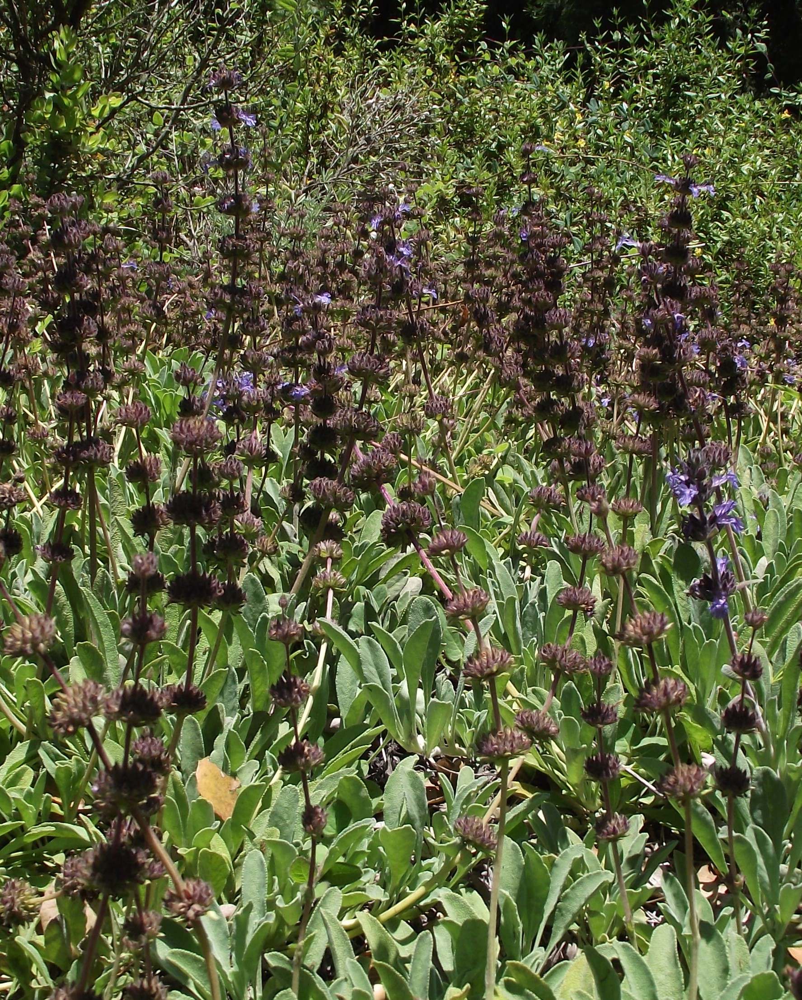 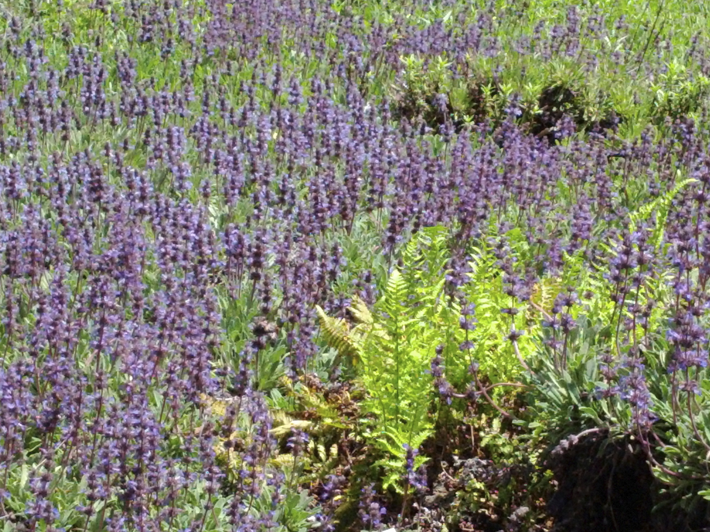 

| | |
|---|---|
| **Height** | 1–2 ft; low spreading mat habit |
| **Texture** | Small, wrinkled, aromatic grey-green leaves; lavender flowers in spring |
| **Shade tolerance** | Partial shade OK |
| **Drought tolerance** | Exceptional |
| **Fruit?** | No |

Creeping sage fills horizontal space efficiently — it spreads 3–5 feet wide while staying low. In front of taller plants, it creates a seamless aromatic ground-level carpet. Strongly scented foliage (similar to Cleveland sage but smaller). Combines especially well with the fine-textured grasses.

**Best placement:** Base of back fence in front of medium shrubs; also the transition strip between fence bed and turf edge.

---

### GRASSES AND SEDGES — 1–4 ft

These add movement, softness, and year-round texture. Critical for the "natural" look — without grasses, native plant gardens can look stiff and static.

---

#### 15. Deer Grass *(Muhlenbergia rigens)*

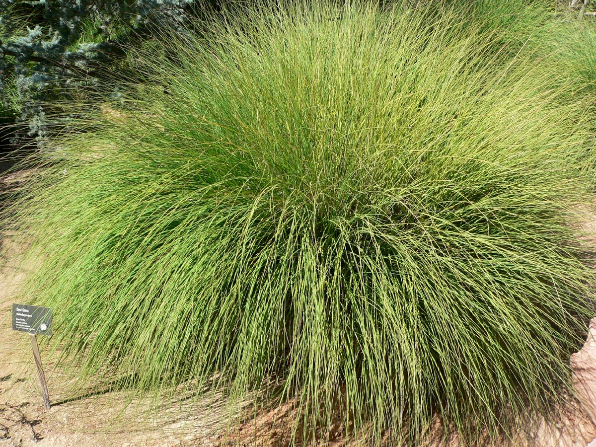  

| | |
|---|---|
| **Height** | 2–4 ft; large clumping mound |
| **Texture** | Fine, arching grey-green blades; tall narrow flower spikes in late summer |
| **Shade tolerance** | Light to partial shade; tolerates more shade than most grasses |
| **Drought tolerance** | Exceptional |
| **Fruit?** | No |

The largest grass on this list — each plant becomes an architectural mound 3–4 feet tall and wide. Works as a textural anchor point in the mid-layer when used between shrubs. The pale flower spikes in August–October add vertical rhythm.

**Best placement:** Scattered through the back fence planting, one plant per 5–6 feet; also as accent in brighter spots on right fence.

---

#### 16. California Fescue *(Festuca californica)*

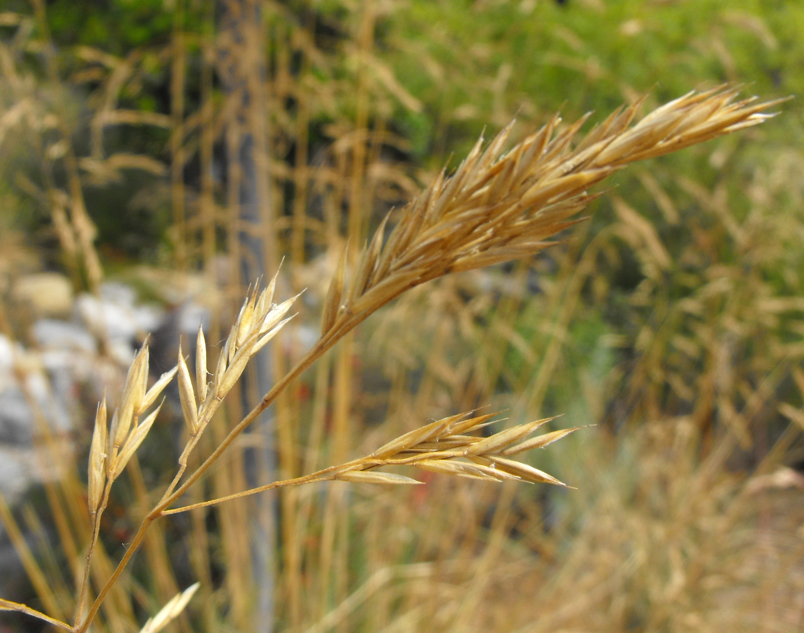  

| | |
|---|---|
| **Height** | 2–3 ft; clumping, arching |
| **Texture** | Blue-green to grey-blue fine blades; soft, arching form |
| **Shade tolerance** | Excellent — tolerates full shade under oaks |
| **Drought tolerance** | Very high |
| **Fruit?** | No |

California fescue is the most shade-tolerant of the larger native grasses. The soft blue-green color adds a cool quality that complements the silvery sages and the darker manzanita foliage. More graceful and arching than deer grass. Evergreen.

**Best placement:** Left fence under the oaks — this handles the deepest shade of any grass on the list.

---

#### 17. Berkeley Sedge *(Carex divulsa)*

  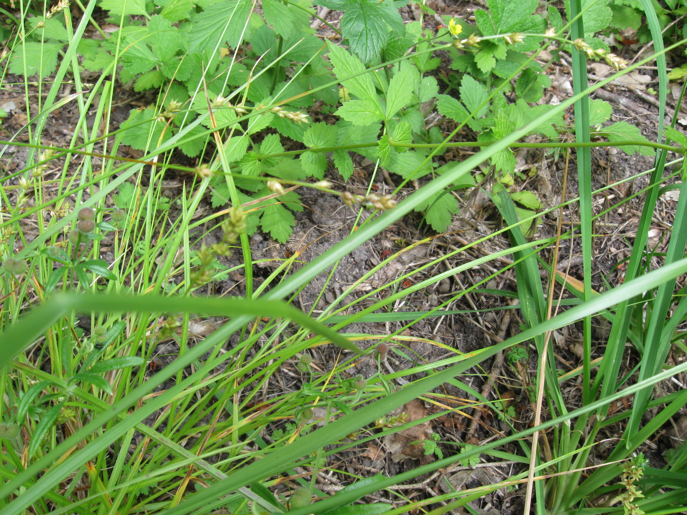

| | |
|---|---|
| **Height** | 1–2 ft; low arching clumps |
| **Texture** | Very fine, arching, dark green blades |
| **Shade tolerance** | Excellent |
| **Drought tolerance** | High once established (benefits from occasional deep watering) |
| **Fruit?** | No |

Berkeley sedge is the workhorse ground-layer grass for California native gardens — it's used at scale in many Bay Area municipal projects. Forms a clean arching mound at the base of fences. It can be used as a semi-lawn substitute in shaded areas if planted densely. Pairs perfectly with Douglas iris and coral bells.

**Best placement:** Front row along the entire left fence; turf edge transition; clusters between low-growing plants.

---

### VINES — climbing, to 15 ft

These grow on the fence itself, softening it from top to bottom and adding vertical interest without taking up ground space.

---

#### 18. California Pipevine *(Aristolochia californica)*

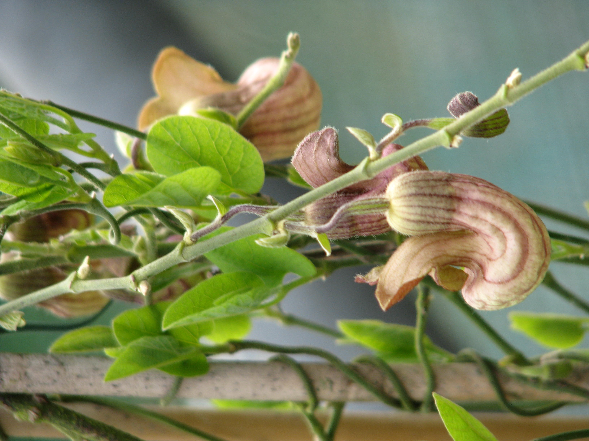  

| | |
|---|---|
| **Height** | 8–15 ft as a climbing vine |
| **Texture** | Large heart-shaped leaves; bizarre curved pipe-shaped flowers in early spring (before leaves); deciduous |
| **Shade tolerance** | Excellent — native to oak woodland understory |
| **Drought tolerance** | High once established |
| **Fruit?** | No (small seed capsules, not fleshy) |

California pipevine is the top vine recommendation for this fence. It climbs wires or a simple trellis, is native to exactly the habitat being replicated here (oak woodland understory), and produces remarkable prehistoric-looking curved flowers in February before the leaves emerge. The large leaves create a lush wall effect through the growing season. Deciduous — bare in winter, which means it needs an evergreen plant in front or below to fill the gap.

**Best placement:** Left fence on wire trellis, especially the sections with deepest shade. It's the natural star jasmine replacement for this condition.

---

#### 19. Chaparral Clematis *(Clematis lasiantha)*

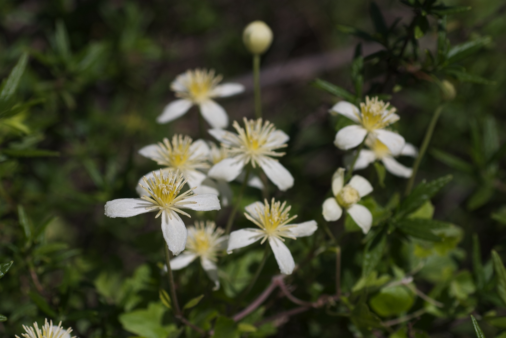  

| | |
|---|---|
| **Height** | 10–15 ft as a climbing vine |
| **Texture** | Compound leaves; masses of creamy-white flowers in spring; distinctive feathery silver seed heads in fall |
| **Shade tolerance** | Partial shade; likes sun on upper growth |
| **Drought tolerance** | Very high |
| **Fruit?** | No (feathery seed tails, not fleshy) |

Chaparral clematis is showier than pipevine in spring — the white flower coverage can be spectacular. The feathery seed heads in fall add a second ornamental moment. It's vigorous and can cover a long fence section quickly. Deciduous. Needs occasional management to prevent it overrunning the shrubs below.

**Best placement:** Back fence or right fence where it gets more sun in the upper growth; alternate fence sections from pipevine for variety.

---

### GROUND COVER — under 1 ft

---

#### 20. Manzanita 'Emerald Carpet' *(Arctostaphylos)*

 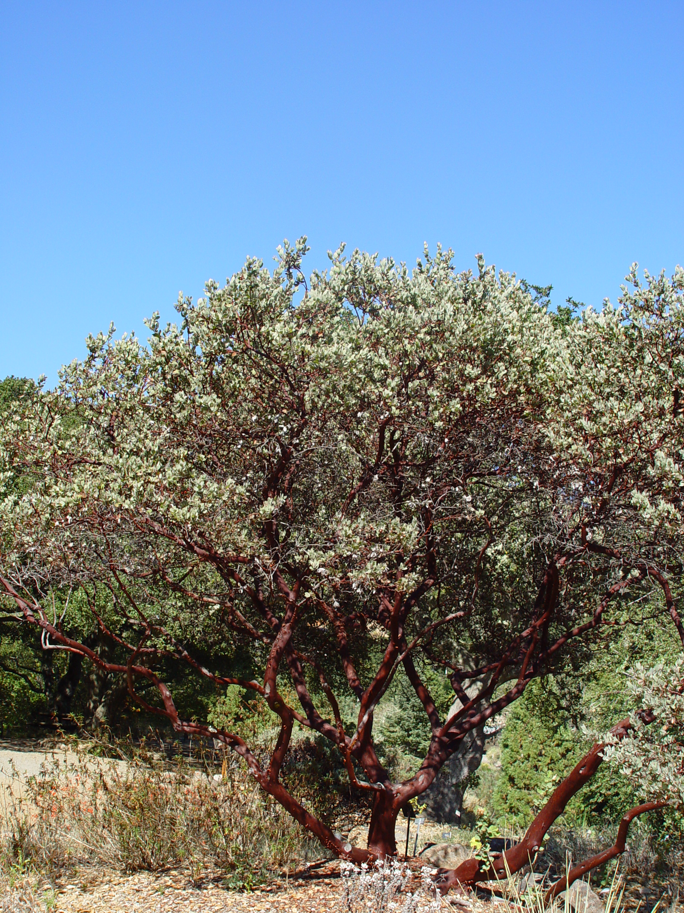

| | |
|---|---|
| **Height** | 6–12 inches; spreads 4–6 ft wide |
| **Texture** | Tiny bright green leaves on arching burgundy stems; small pink flowers in winter; smooth red bark visible through the mat |
| **Shade tolerance** | Partial shade OK |
| **Drought tolerance** | Very high |
| **Fruit?** | No |

'Emerald Carpet' is a low-spreading manzanita that hugs the ground and fills horizontal space rather than height. It looks completely different from Dr. Hurd and Howard McMinn — more like a dense, ornamental ground cover with the same beautiful red bark. Use it at the front edge of planting beds where the fence bed meets the turf or gravel, to create a clean low transition. The images above show the bark texture and typical manzanita form; 'Emerald Carpet' itself sits much lower.

**Best placement:** Front edge of planting beds along the right fence; transition strip between fence bed and artificial turf.

---

## Layering Guide by Fence Section

The three fence sections in this yard have meaningfully different conditions. Here's how to assign the plants above.

---

### Left (West) Fence — Shaded, Under Oak Canopy

This gets the most afternoon shade from the large oaks. Prioritize the most shade-tolerant plants.

```
[Fence]
  ↑ Vine layer:    California Pipevine (on wire trellis)
  ↑ Tall:          Garrya elliptica 'James Roof' (Silk Tassel)
                   Western Redbud (occasional accent)
  ↑ Medium:        Hummingbird Sage (generous drifts)
                   Manzanita 'Howard McMinn' (anchor shrubs)
  ↑ Low:           Douglas Iris (sweeps)
                   Coral Bells (clusters in deepest shade)
  ↑ Ground:        California Fescue (arching clumps)
                   Berkeley Sedge (front edge)
```

**What makes this work:** Garrya + Hummingbird Sage + Douglas Iris is an almost perfect California oak understory combination. All three evolved together in this exact habitat. The pipevine adds vertical softness and follows the same ecology.

---

### Back (North) Fence — Mixed Sun/Shade

Gets morning sun and afternoon shade. The most flexible section for plant choice.

```
[Fence]
  ↑ Vine layer:    Chaparral Clematis (on wire)
  ↑ Tall:          Ceanothus 'Ray Hartman' (main screening)
                   Manzanita 'Dr. Hurd' (1–2 focal specimens)
  ↑ Medium:        Ceanothus 'Concha' (dense filler)
                   Cleveland Sage (brighter sections)
  ↑ Low:           Douglas Iris (sweeps)
                   California Fuchsia (late summer color)
  ↑ Ground:        Creeping Sage (mat between plants)
                   Deer Grass (occasional clumps)
```

**What makes this work:** The tall Ray Hartman gives fast screening. Dr. Hurd provides sculptural contrast. Concha fills the mid-zone with color. The layering feels intentional rather than random.

---

### Right (East) Fence — Brightest, Most Sun

This gets the most direct sun. Use the more sun-tolerant plants here.

```
[Fence]
  ↑ Vine layer:    Chaparral Clematis or none
  ↑ Tall:          Ceanothus 'Ray Hartman' or 'Concha'
  ↑ Medium:        Cleveland Sage
                   Sticky Monkey Flower (long bloom season)
  ↑ Low:           California Fuchsia (late summer red)
                   Blue-eyed Grass (texture variation)
  ↑ Ground:        Manzanita 'Emerald Carpet' (front edge)
                   Creeping Sage
```

**What makes this work:** The right fence benefits from more summer flowering — Sticky Monkey Flower and California Fuchsia both bloom longest with more light. The 'Emerald Carpet' at the base creates a clean modern edge.

---

## Texture Map

A quick reference to the mix of textures in the final planting:

| Texture Type | Plants |
|---|---|
| Sculptural / architectural | Manzanita (all cultivars), Silk Tassel Bush, Western Redbud |
| Dense / fine | Ceanothus (all), Creeping Sage, Manzanita 'Emerald Carpet' |
| Broad-leaved / lush | Hummingbird Sage, Coral Bells, California Pipevine |
| Aromatic / silvery | Cleveland Sage, Creeping Sage |
| Bright seasonal color | California Fuchsia, Sticky Monkey Flower, Redbud (spring) |
| Grass-like / fine | Douglas Iris, Blue-eyed Grass, Berkeley Sedge |
| Arching / moving | Deer Grass, California Fescue, Berkeley Sedge |

---

## Plants Excluded (and Why)

These were considered but ruled out:

| Plant | Reason excluded |
|---|---|
| Toyon | Red berries attract rodents |
| Coffeeberry | Dark berries attract rodents |
| Elderberry | Berries attract rodents and flies |
| Snowberry | White berries |
| CA Honeysuckle | Small berries (borderline) |
| Native Grape (Roger's Red) | Produces grapes |
| Lavender | Too much sun needed for this yard |
| Rosemary | Not native enough for the woodland look |

---

## Top 5 Picks (If Planting in Phases)

If budget or time requires starting small:

1. **Ceanothus 'Ray Hartman'** — Fast screening, spectacular spring bloom, reliable
2. **Manzanita 'Howard McMinn'** — Best manzanita for shade, looks great year-round
3. **Hummingbird Sage** — Easy, spreads nicely, thrives in the hardest spots under oaks
4. **Douglas Iris** — Timeless front-edge plant, requires almost no care
5. **California Pipevine** — Covers the fence vertically, perfectly matched to your oak conditions

These five alone create a cohesive, low-maintenance fence planting. Add the grasses and additional shrubs in year two.
